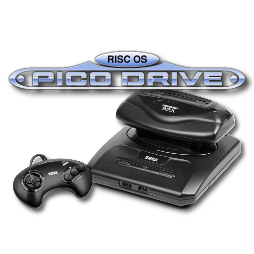

# Sega - MS/GG/MD/CD/32X (PicoDrive)

### Description

PicoDrive is yet another Sega Game Gear / Master System / Mega Drive / Mega CD / 32X emulator heavily optimized for ARM.

### License

MAME

### Icon

### Fanart

Help make me fanart!

### Screenshots

### Disclaimer

*Authors: Dave (aka fdave, FinalBurn author) and notaz*
